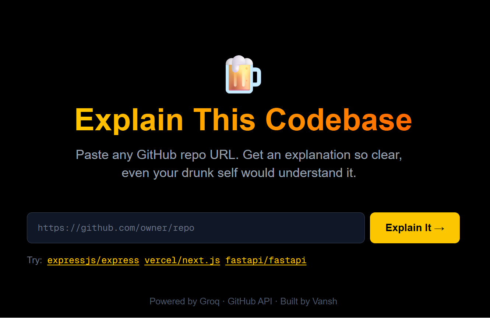
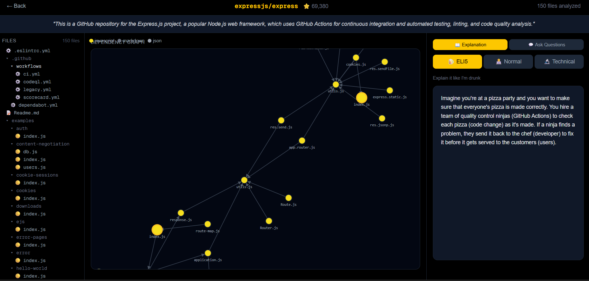

<div align="center">

# 🍺 Codebase Explainer

### *"Explain this repo like I'm drunk"*

**Drop any GitHub URL. Get an explanation so clear, even your drunk self would understand it.**

[](https://codebase-explainer.vercel.app)
[](https://github.com/vansh-kumar-007/codebase-explainer)
[](https://nextjs.org)
[](https://groq.com)

<br/>



</div>

---

## 🎯 What Is This?

Most codebases look like spaghetti to anyone who didn't write them.

**Codebase Explainer** fixes that. Paste any public GitHub repo URL and get:

- 🍺 **ELI5** — explained with pizza shops and LEGO analogies (actually useful)
- 🧑‍💻 **Normal** — architecture overview for junior developers
- 🔬 **Technical** — deep-dive for senior engineers doing a code review
- 🕸️ **Dependency Graph** — interactive visualization of how every file connects
- 💬 **Q&A Chat** — ask follow-up questions about specific files

---

## 🖼️ Screenshots

<div align="center">

### Landing Page


### Dependency Graph + Explanation


</div>

---

## ⚡ Tech Stack

| Layer | Technology | Why |
|---|---|---|
| Frontend | Next.js 16 + TypeScript | App Router, API Routes, type safety |
| Styling | Tailwind CSS | Rapid dark UI development |
| Graph Viz | D3.js | Force-directed graph, drag/zoom/pan |
| LLM | Groq (LLaMA 3.1 70B) | Free, fast, excellent code understanding |
| Data Source | GitHub REST API | 5000 req/hour with token auth |
| Deployment | Vercel | Zero-config Next.js hosting |

---

## 🏗️ Architecture

```
User pastes GitHub URL
        │
        ▼
┌───────────────────┐
│   Next.js Frontend │
│   (App Router)     │
└────────┬──────────┘
         │
    ┌────┴─────────────────────────┐
    │        API Routes            │
    ├──────────────────────────────┤
    │  /api/crawl   → GitHub API   │  ← Fetches up to 150 files
    │  /api/graph   → Parser       │  ← Extracts import relationships
    │  /api/explain → Groq LLM     │  ← Generates 3-level explanation
    │  /api/chat    → Groq LLM     │  ← Answers follow-up questions
    └──────────────────────────────┘
         │
    ┌────┴──────────────────────┐
    │     lib/ (Core Logic)     │
    ├───────────────────────────┤
    │  github.ts   → Crawler    │
    │  parser.ts   → Dep graph  │
    │  gemini.ts   → Groq SDK   │
    │  chunker.ts  → RAG prep   │
    │  types.ts    → Interfaces │
    └───────────────────────────┘
```

---

## 🔍 How the Dependency Graph Works

The graph engine (`lib/parser.ts`) uses **regex-based import parsing** (intentionally, not AST parsing — keeps the bundle lightweight while covering 95% of real-world cases):

- **JavaScript/TypeScript** → parses `import x from "./y"` and `require("./y")`
- **Python** → parses `from .module import x`
- **Resolves relative paths** → `../utils/helper` becomes `src/utils/helper.ts`
- **Detects entry points** → highlights `index.ts`, `main.py`, `app.js` with gold borders
- **Color codes by language** → TypeScript is blue, Python is purple, JS is yellow

The result is fed to **D3 force simulation** which automatically positions nodes so connected files cluster together.

---

## 💡 Key Engineering Decisions

**Why regex over AST parsing?**
AST parsers like `@babel/parser` are more accurate but add ~2MB to the bundle and require per-language plugins. Regex covers 95% of import patterns with zero dependencies.

**Why Groq over OpenAI/Claude?**
Free tier with 14,400 tokens/minute. LLaMA 3.1 70B has strong code comprehension. No credit card required — critical for open source projects.

**Why sequential file fetching instead of parallel?**
GitHub's secondary rate limits throttle burst requests even within the 5000/hour quota. Sequential fetching with 50ms delay is slower but never hits rate limits.

**Why send only 8,000 characters to the LLM instead of all files?**
Groq's free tier has token-per-minute limits. We prioritize the most architecturally significant files (entry points, core lib files) and skip test files and examples.

---

## 🚀 Running Locally

### Prerequisites
- Node.js 18+
- GitHub Personal Access Token ([get one here](https://github.com/settings/tokens))
- Groq API Key ([get one here](https://console.groq.com))

### Setup

```bash
# Clone the repo
git clone https://github.com/vansh-kumar-007/codebase-explainer.git
cd codebase-explainer

# Install dependencies
npm install

# Create environment file
cp .env.example .env.local
# Fill in your API keys in .env.local

# Start development server
npm run dev
```

Open [http://localhost:3000](http://localhost:3000) and paste any GitHub repo URL.

### Environment Variables

```bash
GITHUB_TOKEN=ghp_your_token_here       # GitHub Personal Access Token
GROQ_API_KEY=gsk_your_key_here         # Groq API Key
GEMINI_API_KEY=your_key_here           # Optional fallback
```

---

## 📁 Project Structure

```
codebase-explainer/
│
├── app/                          # Next.js App Router
│   ├── page.tsx                  # Landing page
│   ├── explain/page.tsx          # Main explainer UI
│   └── api/
│       ├── crawl/route.ts        # GitHub file fetcher
│       ├── graph/route.ts        # Dependency graph builder
│       ├── explain/route.ts      # LLM explanation endpoint
│       └── chat/route.ts         # Q&A chat endpoint
│
├── components/
│   ├── DependencyGraph.tsx       # D3 force-directed graph
│   ├── ExplanationPanel.tsx      # Three-tab explanation UI
│   ├── FileTree.tsx              # Collapsible file sidebar
│   └── ChatInterface.tsx         # Q&A chat with history
│
├── lib/
│   ├── github.ts                 # GitHub REST API crawler
│   ├── parser.ts                 # Import/dependency extractor
│   ├── gemini.ts                 # Groq LLM wrapper
│   ├── chunker.ts                # Smart context builder
│   └── types.ts                  # TypeScript interfaces
│
└── screenshots/                  # Add your screenshots here
```

---

## 🎮 Try These Repos

| Repo | Why It's Interesting |
|---|---|
| `https://github.com/expressjs/express` | Clean MVC structure, lots of middleware |
| `https://github.com/fastapi/fastapi` | Python, complex dependency injection |
| `https://github.com/bradtraversy/50projects50days` | Simple, great for testing ELI5 mode |
| Your own project | See what an AI thinks of your code 👀 |

---

## 🛠️ Features Roadmap

- [x] GitHub repo crawling (up to 150 files)
- [x] Dependency graph with D3 force simulation
- [x] Three-level AI explanation (ELI5 / Normal / Technical)
- [x] Interactive file tree sidebar
- [x] Q&A chat with conversation history
- [x] Deployed on Vercel
- [ ] Export graph as PNG
- [ ] Support private repos (OAuth flow)
- [ ] Side-by-side file diff view
- [ ] Shareable explanation links

---

## 👨‍💻 About

Built by **Vansh Kumar** — B.Tech Civil Engineering student at DTU, self-taught in AI/ML, building a portfolio of real AI-powered tools.

[](https://vansh-kumar-portfolio.vercel.app)
[](https://kaggle.com/vanshkumar007)
[](https://github.com/vansh-kumar-007)

---

<div align="center">

**If this made you understand a codebase faster, give it a ⭐**

*Built with 🍺 and way too many API rate limit errors*

</div>
